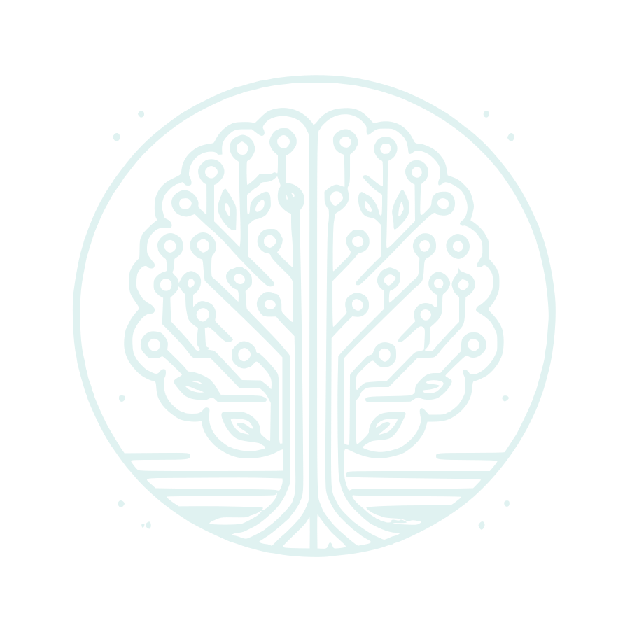

  

# SanctuAIry

**SanctuAIry** is a privacy-first, AI-powered therapeutic assistant. It leverages large language models (LLMs) to simulate therapeutic conversations while prioritizing user confidentiality, privacy, and data security.

## Overview

SanctuAIry is designed to run securely in the cloud within **confidential virtual machines (VMs)**, ensuring that **sensitive user data**—such as therapy sessions and mental health assessments—remains protected and private.

The app aims to provide an empathetic, intelligent, and responsive AI therapist experience by using open-source LLMs, currently powered by **Meta’s LLama 3.2** models.

> ⚠️ While the architecture is planned for deployment in confidential VMs, this feature is not yet implemented. Current development is focused on core functionality.

---

## ⚙️ Architecture

SanctuAIry is built with a modular architecture, composed of the following key components:

### Frontend
A clean and responsive user interface built with **React**, enabling users to interact with their AI therapist in a seamless way.

### LLM Manager
A backend service layer that:
- Routes user input to the appropriate LLM instance
- Manages session context and conversation flow
- Handles model selection, loading, and creation

### LLM Core
The brain of the application, where the actual LLM runs:
- Currently utilizes **Meta’s LLama 3.2**
- Runs in a secured environment to ensure data isolation and confidentiality
- Designed for performance, context awareness, and therapeutic alignment

---

## 🔒 Privacy & Security

SanctuAIry is committed to privacy by design:

- All processing is planned to occur in **confidential virtual machines** with hardware-backed security guarantees
- End-to-end encryption for data in transit, in use, and at rest
- Further planed privancy features:
  - GDPR compliance
  - User-defined data retention and deletion policies

---

## 🚧 Project Status

SanctuAIry is a **work in progress**. The app is under constant iteration with new features and improvements being added weekly.

### Current Focus:
- Improving UI/UX flow and emotional design
- Fine-tuning models for therapy-specific language
- Security hardening and compliance readiness

---

## 📦 Tech Stack

- **Frontend**: React and TailwindCSS
- **LLM Manager**: Node.js and Express
- **LLM Core**: Ollama, using Meta's LLama 3.2

---

## 📄 License

**License: To Be Decided**

This project does not currently have a finalized license. Until then, please reach out before using this code for commercial or derivative purposes.

See the [`LICENSE`](./LICENSE) file (when available) for future updates.

---

## 🙏 Acknowledgements

- Meta AI for the open-source LLama models
- The open-source community for tools and inspiration ❤️
